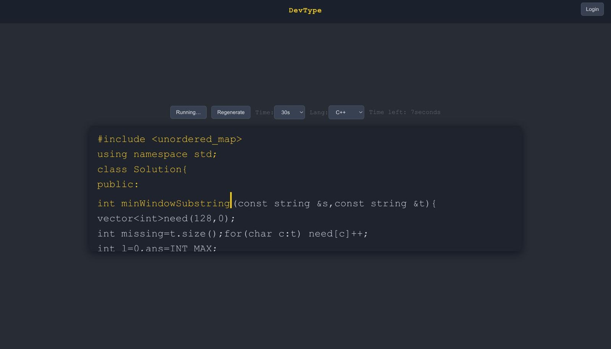
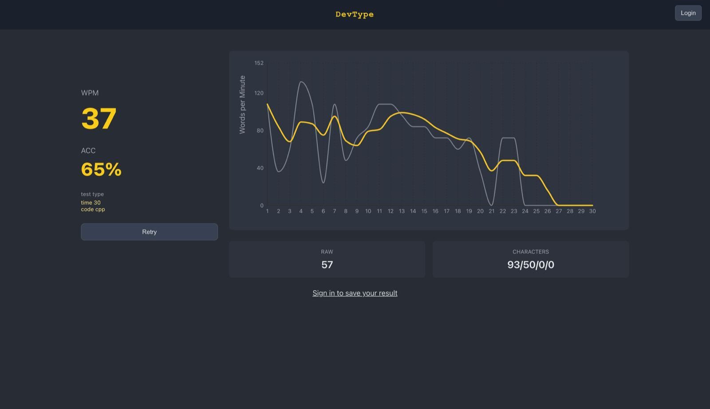
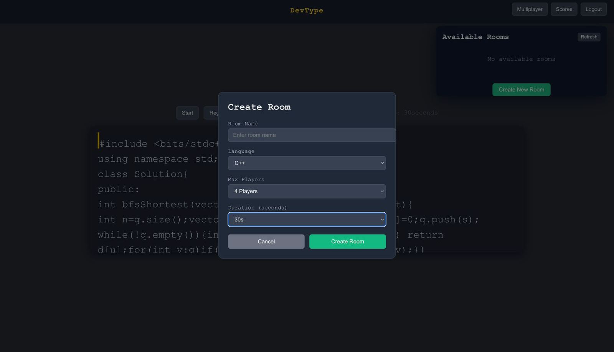

# DevType — Multiplayer Coding Typing Racer

DevType is a developer-focused typing test with a **multiplayer “TypeRacer-style” mode**: join a room, ready up, start on a synchronized countdown, and race on the same code snippet while watching **live ranked progress bars** update in real time.

## Demo / Screenshots

Add screenshots or a short GIF here (recommended).

```text
docs/images/
  typing-test.png
  typing-test-result.png
  room-creation.png
  multiplayer-competition.png
```

Then reference them like:

```md




```

Optional (control width):

```html

```

## Features
- **Single-player** typing test (WPM, accuracy, results)
- **Multiplayer rooms** (create/join/leave)
- **Ready-up lobby** + synchronized countdown start
- **Live race UI** with ranked progress bars (finish-first wins)
- **Real-time updates** via Socket.io

## Tech Stack
- **Frontend**: React + TypeScript (Create React App)
- **Backend**: Node.js + Express
- **Real-time**: Socket.io
- **Database**: MongoDB + Mongoose
- **Auth**: JWT

## Project Structure
```text
devtype/
  src/            # React app
  server/         # Express + Socket.io backend
```

## Quick Start (Local)

### 1) Requirements
- Node.js (LTS recommended)
- MongoDB connection string (MongoDB Atlas works)

### 2) Backend

Create `server/.env` (copy `server/.env.example`):

```bash
MONGODB_URI=YOUR_MONGODB_URI
JWT_SECRET=YOUR_JWT_SECRET
PORT=4000
```

Run the server:

```bash
npm install --prefix server
npm run dev --prefix server
```

Backend: `http://localhost:4000`

### 3) Frontend

Create `.env` in repo root (optional; copy `.env.example`):

```bash
REACT_APP_API_BASE=http://localhost:4000
```

Run the client:

```bash
npm install
npm start
```

Frontend: `http://localhost:3000`

## Multiplayer (How to Play)
1. Login with 2 users (two browsers / incognito works best)
2. Open **Multiplayer**, create a room
3. Join the same room from the second user
4. Both click **Ready Up**
5. Countdown starts automatically (3…2…1)
6. Race: the first player to complete ranks #1 and is shown as the winner

## Environment Variables

### Backend (`server/.env`)
- `MONGODB_URI` (required)
- `JWT_SECRET` (required)
- `PORT` (optional, defaults to `4000`)

### Frontend (`.env`)
- `REACT_APP_API_BASE` (optional, defaults to `http://localhost:4000`)

## API (Backend)

Auth:
- `POST /api/auth/register` → `{ username, password }` → `{ token }`
- `POST /api/auth/login` → `{ username, password }` → `{ token }`

Rooms:
- `GET /api/rooms`
- `POST /api/rooms`
- `POST /api/rooms/:roomId/join`
- `POST /api/rooms/:roomId/leave`
- `POST /api/rooms/:roomId/ready` → `{ ready: boolean }`

Scores:
- `POST /api/scores`
- `GET /api/scores`
- `GET /api/scores/avg`

## Real-time Events (Socket.io)
- `join-room` / `leave-room`
- `room-updated`
- `competition-starting` / `competition-countdown` / `competition-started`
- `participant-progress`
- `competition-finished`

## Troubleshooting
- If ports are busy:
  - Frontend: `3000`
  - Backend: `4000`
- Ensure MongoDB is reachable and your `.env` values are correct.
